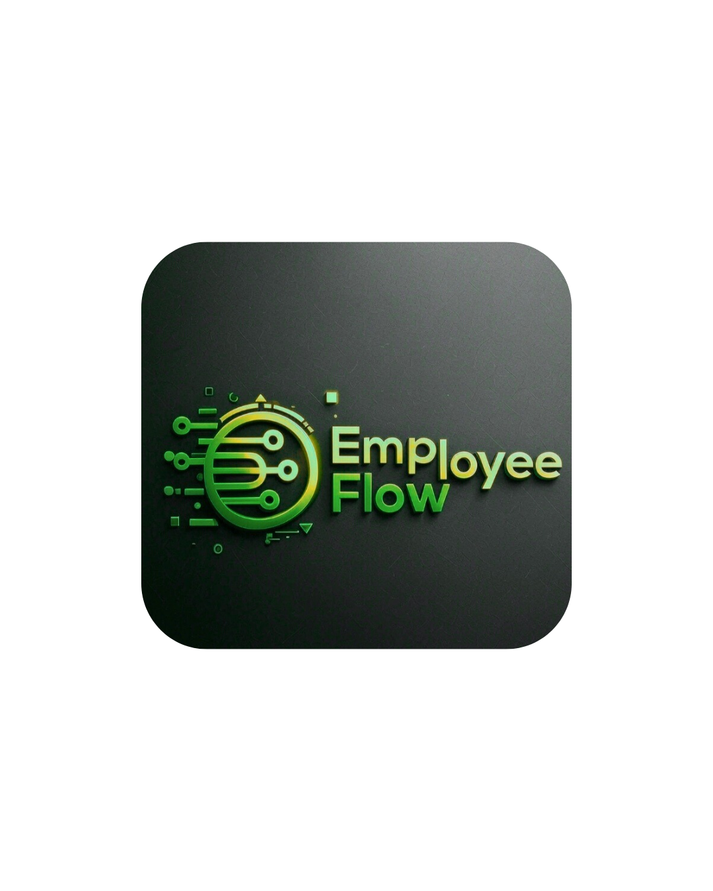
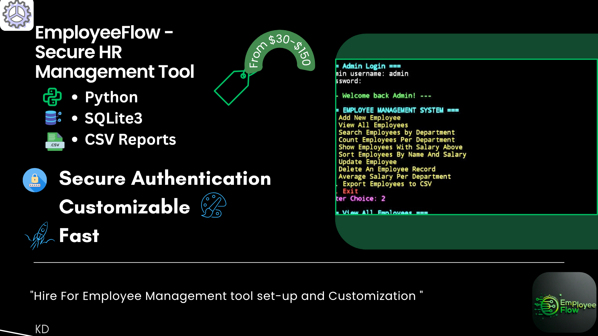
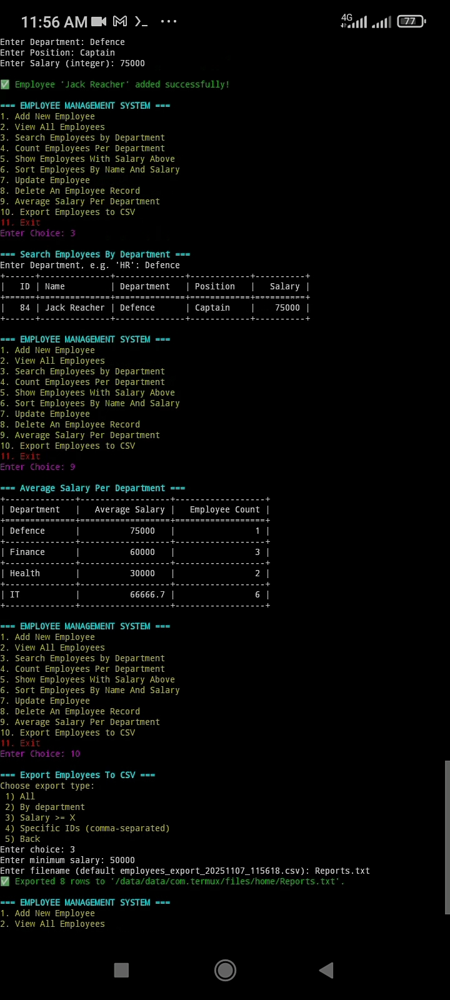

#Employee Management System (Secure HR Tool)

A Python-based secure Employee Management System for businesses — Open Source under MIT License

Table of Contents

1. Overview

2. Features

3. Installation

4. Usage

5. Demo

6. Configuration
  
7. Contributing

8. License

1. #Overview

The Employee Management System HR Tool is a fully-featured, secure, and easy-to-use Python application designed to help businesses manage their employee data efficiently. It uses SQLite for storage and comes with input validation, secure login, and reporting features.

Ideal for small to medium-sized businesses, this tool can be customized for your specific HR needs.

# Cover

#Screenshots

#Demo
Check out the demo video: [Demo Video](./Demo video.mp4)

2. #Features

• Add, view, update, and delete employee records

• Department-wise and role-wise employee management

• Average salary calculations per department

• Secure login for HR admins

• Input validation to prevent errors

• Export employee data to CSV for reporting

• Easy-to-configure SQLite database backend

• Open source and customizable for your business

3. #Installation

• Clone the repository:

git clone https://github.com/kalinoosi681-droid/employee-management-system.git
cd employee-management-system

• Install Python 3 (if not installed):

pkg install python  # Termux / Linux

• Install dependencies:

pip install tabulate colorama

• Run the application:

python employee_system_secure_app.py

The system will automatically create the database file (Employees.db) if it does not exist.

4. #Usage

• Add Employee
Input employee name, department, and position. The system validates all entries.

• View Employees
Displays a formatted table of all employees with department and position details.

• Update Employee
Update employee records securely by entering the employee ID.

• Delete Employee
Remove employees safely with confirmation prompts.

• Reports & Export
Export data to CSV files for backups or analysis.

6. Configuration

• Database: The default SQLite database file is Employees.db.

• Dependencies: tabulate for table formatting, colorama for colored terminal output.

• Customization: Easily switch to another database or add more fields by modifying the get_connection() function and database schema.

7. Contributing

Contributions are welcome! You can:

• Report issues

• Suggest new features

• Submit pull requests

# Future Plans
- Add a web interface (Flask-based).
- Include payroll and integrations.
- Scale for big industry use.

## Contact
Connect with me on [LinkedIn](https://www.linkedin.com/in/kalinoosi) or hire me on Fiverr!

8. License

This project is licensed under the MIT License — see the LICENSE
 file for details.
